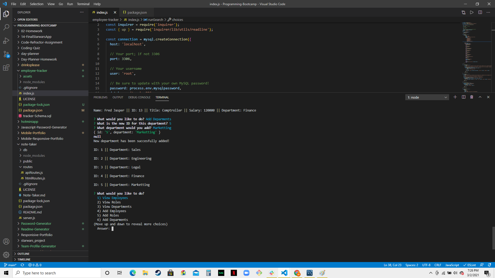

# Employee Tracker

## Description

This is an app to track employees, roles, and departments. It uses node.js, mysql, and inquirer. It allows you to view and add  departments, employees, and roles. It also allows you to update employee roles

## Video & Screenshots

[Video of Completed application](https://drive.google.com/file/d/1TdF1pgw2QoGNy2zY0kS9hx_nka7nX9Ai/view)

## Installation
To install dependencies, run the following command(s):

npm install

## Usage

Use this to help manage employees

## License

This project is licensed under the terms of the MIT license.

## Contribution-Guidelines

If you wish to contribute. Please refer to the following guidelines:
[Contributor Covenant](https://www.contributor-covenant.org/)

## Contributors

[duffieldml](https://github.com/duffieldml)

## Tests

To test the application, please do the following:
No testing

## Questions

If you have any questions regarding the repo, application, or issues you are experiencing, please email
the following:
[duffieldml@gmail.com](mailto:duffieldml@gmail.com)
